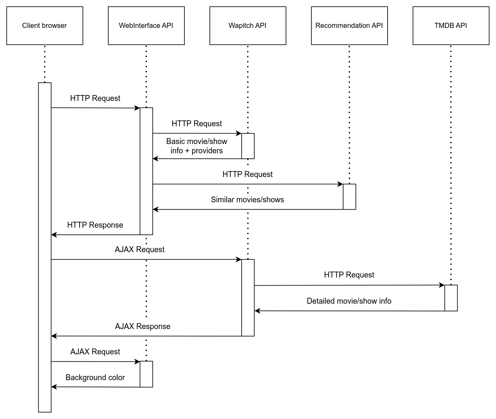

# WebInterface
This is a [Flask](https://flask.palletsprojects.com/en/3.0.x/) web app made as a part of [Discyo](https://discyo.com/) - a cross-media recommendation platform project.


## Configuration and Setup

Before running the WebInterface, it's essential to configure the required environment variables. In the `web_interface/app/config.py` file, please set the following:

- `WAPITCH_BASE_URL`: Replace with the appropriate base URL for the Wapitch API.
- `RAPI_BASE_URL`: Replace with the appropriate base URL for the Recommendation API.

Ensure these values are correctly set to ensure the functioning of the WebInterface. For local deployment of the WebInterface, a Docker configuration is provided and ready to use:
```bash
docker-compose up --build
```

## API Interaction Flow Diagram
The diagram illustrates the interaction flow between the client browser and the WebInterface API, and further delineates the interactions between the WebInterface API with the Wapitch API, Recommendation API, and TMDB API. Through this design, users are presented with detailed information about movies/shows, but the key to TMDB API, from which these details are sourced, is held by Wapitch and remains inaccessible to the user.


